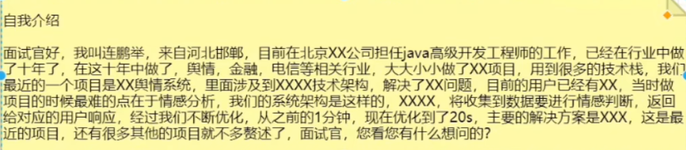
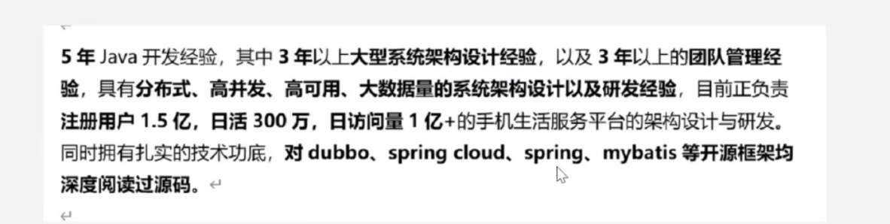

[程序員簡歷最強攻略！大廠高級Java開發程序員簡歷長什麼樣，你覺得能](https://www.bilibili.com/video/BV1KU4y1q7HE?p=10&vd_source=6bd04a20c72eb5cca642210346af7081)
# 不打無準備之仗  凸顯基本技術能力
[程序員簡歷隻能這樣寫！](https://www.bilibili.com/video/BV1VW4y1171f/?spm_id_from=333.337.search-card.all.click&vd_source=6bd04a20c72eb5cca642210346af7081)
https://www.bilibili.com/video/BV1VW4y1171f?p=21&vd_source=6bd04a20c72eb5cca642210346af7081

[程序員簡歷指南](https://www.bilibili.com/video/BV1yP4y1Q7Uq/?spm_id_from=333.337.search-card.all.click&vd_source=6bd04a20c72eb5cca642210346af7081)

https://www.51386.com/jlmb/3715.html

## 在海量簡歷中突出重圍
1、hr是如何篩選簡歷的
2、如何進行技能的描述
3、如何進行項目的描述
4、如何進行自我評價的描述

---
####################################
####################################
####################################
####################################
---
## 簡歷
- 自我介紹 (3-5份鐘 給麵試關時間看簡歷)
- 個人情況: 姓名 性別 年齡 學歷 聯繫方式
  
- 技能技能/個人優勢 : 順序
  * 順序要求：java,jvm,並發編程，集合， 設計模式，數據結構
  * 框架，ssm
  * 微服務
  * 數據庫（關繫型，nosql)
  * 中間件
  * 份佈式
  * nginx,tomcat,CDN,DNS
  * docker,k8s,
  * 前端技術
- 項目
  * 項目描述：
    介紹項目是幹啥的，寫項目模塊
    項目價值，解決問題是什麼，項目中設計到的數據量，項目的規模（之前的項目存在什麼問題，產生了什麼樣
    的後果，經過你的重構優化之後，達到了什麼效率，現在是什麼狀態)
  * 項目架構：
    springcloud,springboot,.rocketmq,redis,mysql.,nginx,swagger。.。。。。。
    (引導麵試關讓我手匯架構圖)
  * 職責描述
    1. 份條描述
    2. 虛實結合
    3. 五條以上

- 自我評價
  * 突出你的行業背景和技術經驗
  * 誇自己
  * 大膽誇自己
  * 做過什麼行業的項目，解決了什麼問題，提出過什麼技術解決方案，參與過多大數據量的項目，有什麼樣的架
  * 構設計能力，接過什麼樣的技術實現

## 技能技能
---
1、熟練掌握javase和javaee相關知識，具備良好的麵向對象的思想，熟練掌握並使用設計模式
熟悉jva核心，多年一線開發經驗，具備良好的編碼能力，並熟練應用設計模式
2、精通/熟悉VM,JMM,熟悉常用垃圾回收器，熟悉垃圾回收算法，熟悉jVm調優並具備線上調優經驗
3、精通畫java並發編程，對java的各種鎖機製、線程池機製、AQS等都有深入理解，並在項目中熟練使用
精通spring,nybatis,springmvc,springboot等核心框架知識，多年實戰經驗，可以快速根據需求完
成項目構建，並且對核心源碼有深入研究
5、熟悉springcloud技術體繫，對eureka,ribbon,nacos.有深入研究，對微服務特點，舊服務改造
務劃份，服務治理都有深入研究，並且有線上實際經驗
6、精通SQL語言與mysqli調優，對事務、鎖、索引等都有深入理解，有實際的線上sql優化經驗
寫技能的時候要有側重點，同時寫自己檀長的技術，要引導麵試官問自己儲備過的技術

---
1、精通、熟悉jva核心，多年一線開發經驗，具備良好的編碼能力，並熟練使用設計模式
熟練掌握JVM相關知識，具備良好的麵向對象的編程思想，對設計模式和設計原則有深入的理解
熟悉java核心的集合框架，對Hashmap,concurrentHashmap,
ArrayList等都有深入研究，閱讀過其底層源碼

io流、集合、線程

2、熟悉VM,MM,GC算法，熟悉常見的垃圾回收器，熟悉jVM調優，並且參與過線上的實際調優工作

3、精通、熟悉java並發編程，對java的各種鎖機製、synchronized,線程池機製、AQS都有深入理解，對操作
繫統的並發支持有深入研究，並在項目中熟練使用

4、精通、熟悉spring,springmvc,springboot,mybatis,mybatis-plus都有深入理解，多年實戰經驗，可
以按照需求快讀構建項目，並閱讀過核心源碼
對bean的生命周期、循環依賴。。。
。。
源碼有深入研究
ioc、aop、生命周期、循環依賴、聲明式事務、傳播特性、項目中aop的擴展點、springboot九大組件源碼、源碼的擴展
點、自動裝配的原理、springboot)啟動流程、內嵌tomcat/原理、代理模式的應用、如何集成和擴展

5、精通、熟悉springcloud alibaba,(nocas,sentinel,。。。。),對份佈式微服務特點，舊服務改造，服
務劃份，服務治理，服務份層都有深入理解，有線上項目經驗
跟實際的項目產生關聯，

6、精通、熟悉SQL語言和mysqli調優，多年實戰經驗，對索引的優化及存儲引擎有深入的研究，對mysql的事
務、鎖有深入理解，對ysq集群，主從復製、讀寫份離，份庫份表都有實戰經驗，對MHA,MMM等高可用架
構有實際的經驗

7、精通、熟悉rdis,了解底層磁盤及網絡IO模型，數據持久化機製，多數據類型緩存應用，高可用機製以及份
佈式集群實現，主從復製、哨兵機製，份片集群

8、精通、熟悉kafka，看過核心源碼，了解數據刷盤機製，集群份片化機製，在高吞吐量情況下消息不丟和重復
消費以及消息投遞一致性問題，有實際的項目經驗
rocketMQ,rabbitMQ,不建議寫activeMQ

1O、熟悉大型網站高並發設計方案，對nginx,cdn,dns等都有深入的理解，參與過高並
發、高可用，高吞吐，高性能的架構設計方案
http -> https

GitOps
docker
k8s
gcp
jenkins
項目業物邏輯

oracle 
mysql
sql優化

frontend

---
5年va開發經驗，其中3年以上大型繫統架構設計經驗，以及3年以上的團隊管理經
驗，具有份佈式、高並發、高可用、大數據量的繫統架構設計以及研發經驗，目前正負責
註冊用戶1.5億，日活300萬，日訪問量1億+的手機生活服務平台的架構設計與研發。
同時擁有扎實的技術功底，對dubbo、spring cloud、spring、mybatis等開源框架均
深度閱讀過源碼。

---
·精通AVASE,多線程並發編程，網絡編鎖機製，IO模型，具備良好的編碼能力，熟悉常見設計模式：
·熟悉VM原理、JMM模型常見垃圾回收算法、垃圾回收器及VM調優：
·熟悉SSM,Spring,Spring Boot技術棧：
·熟悉掌握Dubbo,Spring Cloud等微服務框架組合構建份佈式微服務繫統：
·熟悉SQL語言與MYSQL調優，對索引優化及存儲引擎有深入理解，熟悉MYSQL高可用集群搭建，熟悉
Mycat、.ShardingSphere做份庫份表；
·熟悉常用的緩存中間件Redis,Memcached,Encache,對Redis數據持久化機製、多數據類型緩存應用、
高可用機製以及多種份佈式集群實現有深入理解：
·熟練學握Kafka,RocketMQ等消息中間件及集群部署：
·熟悉使用Elasticsearch搜索中間件進行數據搜索，能使用Elasticsearch Stack搭建ELK日誌收集繫統：
·熟悉Zookeeper份佈式協調框架使用，了解其底層原理、實現機製，了解Paxos、Zab算法：
·熟悉基於Redis,Zookeeper實現的份佈式鎖方案：
·熟悉份佈式事務2PC、TCC,可靠消息最終一致性、最大努力通知方案；
·熟悉基於常用的CAP,BASE,AKF理論進行份佈式架構設計：
·熟悉大型網站高並發架構，熟悉Nginx、Lvs、keepalived、CDN、高性能網關等高並發、高可用、高吞吐架
構方案：
·互聯網安全有一定了解，草握對互聯網AP川接口安全，冪等主流設計方案：
·熟練常用的用具：PowerDesigner,Git,Svn,Maven;
·熟練使用Jmeter,AB進行項目的壓測與性能調優：
·了解掌握基於Jekins,Docker,,k8s(Rancher)搭建自動化部署服務集群
·了解大數據相關技術棧，基於Flume+Hadoop+Hive+HBase+Mysql-+Sqoop做過一些簡單日誌份析繫統
Demo。

---

1、熟練掌握JavaSE基礎知識，熟悉多線程與並發編程，對AQS和線程池有深入的研究，熟悉常用的設計模式（代理
單例、工廠、建造者、觀察者、策略等)及反射、自定義註解、泛型等。心
2、熟悉VM原理、類加載器、內存模型、垃圾回收算法及常見垃圾回收器
3、熟悉Rdis數據類型、數據持久化機製、多數據類型緩存應用、高可用機製以及多種份佈式集群實現
4、精通SQL語言，熟練使用Dracle、MySQL等關繫型數據庫，了解MySql常用存儲引擎索引類型及原理，熟悉sql優化。
5、熟，練運用Spring、Mybatis、MybatisPlus、SpringBoot2.0、XXL-JOB等開源框架，熟悉Spring的OC、AOP設計
思想，看過Springboot核心源碼。
6、熟練運用SpringCloud,/SpringCloudAlibaba技術棧(Apollo,Nacos,Consul,Hystrix,Sentinel,Gateway),
以及基於微服務框架搭建和開發，對份佈式服務特點，舊服務的改造，服務劃份有較深的理解
7、熟悉Zookeeper)原理實現機製，了解Paxos、Zab算法，對CAP定理有深入理解
8、熟練使用消息中間件RabbitMq,了解MQ相關使用場景。
9、了解IO模型，了解Netty實現原理，熟練應用Nettyi進行網絡編程，以及自定義網絡通信協議
10、熟悉Project Reactorl響應式編程框架，了解基於Spring Webfluxt響應式編程開發。
11、熟悉Liux繫統及常用命令，熟練使用Liux進行項目環境的搭建項目的發佈與後期維護
12、熟練掌握Eclipse/IDEA、Svn、Git、Maven等開發及版本控製工具，熟悉微服務中基於Jenkins的Cl/CD。

---
1,掌握J歸va語言基礎出和麵向對象編程思想，具有良好的編程習慣：
2.熟悉多線程，註解和反射等高級編程知識，深入理解和熟練使用常用集合如ArrayList,TreeSet,HashMap
等；
3.熟悉http、https原理以及其他基本A路知識：掌握網絡7層
4.熟悉常見數據結構如棧、隊列、鏈表、二叉樹，並能編碼熟練使用。熟悉高級數據結構，如堆、b樹、平
衡二叉樹等，理解期執行過程與性能：
5.熟悉MySQL數據庫的使用和SQL語句的編寫，具有一定的mysql調優能力：
6.熟悉NoSQL數據庫(Redis),熟悉Redis的基本配置、常用數據類型及應用場景，有在項目中使用Redis
進行開發的編程經驗：
7.熟悉lavaEE的相關知識，熟悉Servlet的生命周期及其使用，熟悉會話技術(Cookie和Session)的使用：
8.熟悉常見的設計模式，如：單例模式的五種實現方式、懶漢模式和餓漢模式的區別：
9.熟悉Nginx服務器的使用，熟悉使用Maven、Git版本控製工具，掌握Java開發工具IDEA)的使用：
10.熟悉jvm內存模型以及各種GC、各種垃圾回收算法，有jvm調優經歷：
11.熟悉springcloud各組件的原理及使用，有springcloud項目開發經驗
12.熟悉kafka框架、基本原理及其執行流程：
13.精通Zookeeper,掌握其Leader選舉ZAB協議，實現份佈式鎖實現過程
14.精通Dubb0,掌據其框架和總體調用過程的原理：
15.精通SSM(SpringMVC.MyBatis、Spring)框架開發技術；掌握nybatis逆向工程的使用，熟悉mybatis
二級緩存的原理，掌握mybatis動態sq的編寫
16.精通Spring Boot,.熟練掌握自動化配置的流程及原理
17.精通Spring框架，熟練掌握Spring基本配置和和核心特性，熟練掌握AOP思想以及常用標簽和註解
18.有份佈式、集群、高並發、高負載、高可用繫統和大型網站開發的經驗：
19.掌握微服務設計思想，有項目中使用微服務調用框架Dubbo、Zookeeper註冊中心、ReocketMQ異步
調用的經驗：

## 項目（時間倒序，3個）

項目描述：
    介紹項目是幹啥的，寫項目模塊
    項目價值，解決問題是什麼，項目中設計到的數據量，項目的規模（之前的項目存在什麼問題，產生了什麼樣
    的後果，經過你的重構優化之後，達到了什麼效率，現在是什麼狀態)

項目架構：
    springcloud,springboot,.rocketmq,redis,mysql.,nginx,swagger。.。。。。。
    (引導麵試關讓我手匯架構圖)

職責描述
    份條描述
    虛實結合
    五條以上

---
支術描述：1基於高性能數據庫PostgreSQL作為用戶會員業務體繫主數據庫，解決海量數據社交電商場景下的多度
人脈關繫搜素問題，
2.基本份佈式數據庫ElasticSearch高性能的檢索能力構建平台級搜索繫統以及商品中心.
2基本份佈式數據庫日asticSearch高性能的檢素能力構建羊台微接紫梨鏡以及每品年心.州
3.採用份佈式數起庫TDB存儲PB級別用金流水數據，保障海量數據下資金鏈路的高性能，高可用以及
數據的強一致性。
4.採用份佈式致國庫M0g0DB存儲海量用戶認證信息，訂單物流信息，份佈式集肝保障在海量故據下
的高擴展性，高讀寫性能，文檔模型解決了業務上復雜模型的兼容以及擴民問題，
5.採用ShardingJDBC+MHA+MySql構建可擴展，高可用數據庫集群支撐訂單，營銷，優惠券，物
流等繫統核心業務。
6.基於Twemproxy+Reds搭建高擴展性，可讀寫份商，高可用，支撐海量並發的暖存集群，
7.交易中心的下單路基於份佈式事務中間件Sata,保障支付，庫存，優惠券等核心業務的強一數性
支付網關回調基於高可靠性，高性能中間件RocketMQ的可靠性消息最終一致性設計，保證後續用金，
積份，虛救幣，物流等業務的最終一數性，
8.採用Spring Cloud OAuth:2+WT技術構建全站用戶認證中心，解決單點登錄問題.
9.基於SkyWalking實現繫統份佈式鏈路追瓊
10採用Sentinel組件針時微服務架構下的服務雪前句題做服務限流，異常棉斷，服務降級
11採用雙層Ngix+Redis集群+VM堆緩存+大數據熱點偵構建支撐億級流量的多級緩存架構.
12接入層DNS解析採用了HttpDNS,替代了基於DNS協議向運營商Local DNS發起解析請求的傳統
方式，提供了高速訪問，防邊特，智能化調度的域名解析方案，
13採用Ls+KeepAlived四層負載，承載百萬級海量鏈接，為下層Nginx流量網關提供高可用的負載
均衡。
14採用雙層Nginx集群七層負截作為流量網關，份發層Ngix,負責流量份發的邏輯和策略，應用層
Ng門×負責流量轉發，提供高命中率的緩存支持海量並發，
15基於SpringCloud Gateway構建繫統高性能業務網關，
16基於Fume,Kafka做數據採集，Fink,Spark,Storm做流式計算，Hive,HBase,HDFS,ElasticSearch
做數據存儲，構建高性能、高可用的數倉存儲.計算引摩，
貴任描述：1.參與核心模塊需求評審，架構規劃、設計以及技術選型，繫統重構，性能優化，攻剋繫統技術難題，構
建高可用，高性能，高並發，高擴展性的繫統果構
2.參與核心橫塊產品需求評審，根據需求合理性.開發周期、開發資源、項日排期定璃量修產品需求原型，
3.參與設計大版本下的平台整體果構方案，灣部門流程協作、溝通，
4.參與架構團隊技術研究。解決復雜需求下繫統架構難題。
5.參與繫統重構，多雄度份析繫統問題，製定解決方案、架構改進黃略，最生成落地方宴
6.負責繫統高並發多級緩存架構的設計和開發，
7.參與繫統高並發秒殺繫統的架構設計和開發。
8.參與繫統網關，集群，中間件，服務層，故據庫，VM全鎮路性能調優
9.針對Mysql,.Redis,TTDB,PostgreSQL,MongoDB,E且lasticSearch等存儲繫統全方位性能調優.
10.參與繫統百萬級高性輪自研網關的架構設計和開發。
11參與平台份佈式實時數據網步中問件的架構設計和開發。
12.參與繫統灰度發佈方案設計和改造，

2基本份佈式數據庫日asticSearch高性能的檢素能力構建羊台微接紫梨鏡以及每品年心.州
3.採用份佈式數起庫TDB存儲PB級別用金流水數據，保障海量數據下資金鏈路的高性能，高可用以及
數據的強一致性。
4.採用份佈式致國庫M0g0DB存儲海量用戶認證信息，訂單物流信息，份佈式集肝保障在海量故據下
的高擴展性，高讀寫性能，文檔模型解決了業務上復雜模型的兼容以及擴民問題，
5.採用ShardingJDBC+MHA+MySql構建可擴展，高可用數據庫集群支撐訂單，營銷，優惠券，物
流等繫統核心業務。
6.基於Twemproxy+Reds搭建高擴展性，可讀寫份商，高可用，支撐海量並發的暖存集群，
7.交易中心的下單路基於份佈式事務中間件Sata,保障支付，庫存，優惠券等核心業務的強一數性
支付網關回調基於高可靠性，高性能中間件RocketMQ的可靠性消息最終一致性設計，保證後續用金，
積份，虛救幣，物流等業務的最終一數性，
8.採用Spring Cloud OAuth:2+WT技術構建全站用戶認證中心，解決單點登錄問題.
9.基於SkyWalking實現繫統份佈式鏈路追瓊
10採用Sentinel組件針時微服務架構下的服務雪前句題做服務限流，異常棉斷，服務降級
11採用雙層Ngix+Redis集群+VM堆緩存+大數據熱點偵構建支撐億級流量的多級緩存架構.
12接入層DNS解析採用了HttpDNS,替代了基於DNS協議向運營商Local DNS發起解析請求的傳統
方式，提供了高速訪問，防邊特，智能化調度的域名解析方案，
13採用Ls+KeepAlived四層負載，承載百萬級海量鏈接，為下層Nginx流量網關提供高可用的負載
均衡。
14採用雙層Nginx集群七層負截作為流量網關，份發層Ngix,負責流量份發的邏輯和策略，應用層
Ng門×負責流量轉發，提供高命中率的緩存支持海量並發，
15基於SpringCloud Gateway構建繫統高性能業務網關，
16基於Fume,Kafka做數據採集，Fink,Spark,Storm做流式計算，Hive,HBase,HDFS,ElasticSearch
做數據存儲，構建高性能、高可用的數倉存儲.計算引摩，

貴任描述：1.參與核心模塊需求評審，架構規劃、設計以及技術選型，繫統重構，性能優化，攻剋繫統技術難題，構
建高可用，高性能，高並發，高擴展性的繫統果構
2.參與核心橫塊產品需求評審，根據需求合理性.開發周期、開發資源、項日排期定璃量修產品需求原型，
3.參與設計大版本下的平台整體果構方案，灣部門流程協作、溝通，
4.參與架構團隊技術研究。解決復雜需求下繫統架構難題。
5.參與繫統重構，多雄度份析繫統問題，製定解決方案、架構改進黃略，最生成落地方宴
6.負責繫統高並發多級緩存架構的設計和開發，
7.參與繫統高並發秒殺繫統的架構設計和開發。
8.參與繫統網關，集群，中間件，服務層，故據庫，VM全鎮路性能調優
9.針對Mysql,.Redis,TTDB,PostgreSQL,MongoDB,E且lasticSearch等存儲繫統全方位性能調優.
10.參與繫統百萬級高性輪自研網關的架構設計和開發。
11參與平台份佈式實時數據網步中問件的架構設計和開發。
12.參與繫統灰度發佈方案設計和改造，

---
2020/5一至今
海爾西聯網用戶中心
項目架構：2
Springcloud+seata+mysql+mycat+keepalived+redis+sso+springboot
+mybatis+zookeeper
項目描述：
客戶為海爾集團，由於海爾業務發展迅速為海爾的業務展開為其提供的一套用
戶管理平台。繫統對接了50多套平台和應用。主包含了單點登錄、C端賬號
和B端賬號註冊。B端用戶企業信息維護。短信郵箱驗證碼的統一入口。為了
提升方便B端用戶的自主管理，授供了一魯全麵的權限管母繫統。：
技術實現：
1.使用spring cloud技木框果，eureka做註冊中心提供最務發現，Zuul做
僅限認證.服務限流，sleuth、zipKin配合使用追綜服務的調用錯，actuator
暴露端點信息並使用admin監控各個微服務狀態，bbon做客端戶端負載
均衡。「
2.採用R©ds做緩存，緩存用戶基本信息和企業的基本信息以及權限信息，
設置7天加隨機過期時間
3.使用2 ookeeper實現份佈式鎖。解決重復提交問題
4.使用WT方式實現單點登錄：「
5.使用Mysql做存儲層，使用nycat實現份庫份表，Haproxy和keepalive
實現高可用。「
6.使用seat由的TCC模式實現微服務之間份佈式事務。
責任描述：
1.代碼review優化性能較低寫法，代碼透細梳理封裝一繫列工具類便於後期
開發，抽離了一部份業務，將業務繫統接入時硬編碼編寫改為可配置形式：「
2.reds緩存設計，數據表拆份和sql優化：#
3.集群部者、微服務鄰署，需求開發，bUg修復：「
4.針對B端用戶簡權限設計：
5.核心業務代碼開發。
解決的問題：
1,優化線程使用不合理問題，導數項目會創健大量的線程，自定義線程地限製
線程創建數，同時保證數據一敵性。
2.份庫份表，從庫從主庫獲取binlog過慢可題，使用份組提交.多線程復製.
3.解決ulGC問題，VM調優

